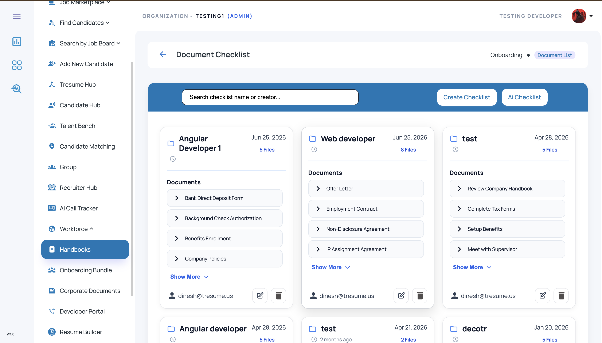
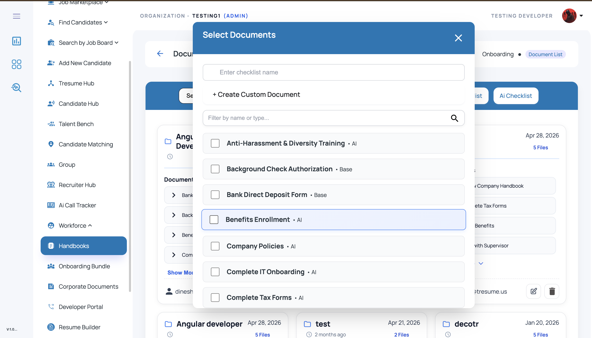
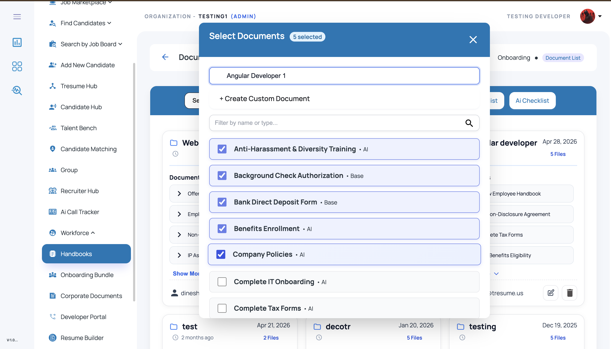
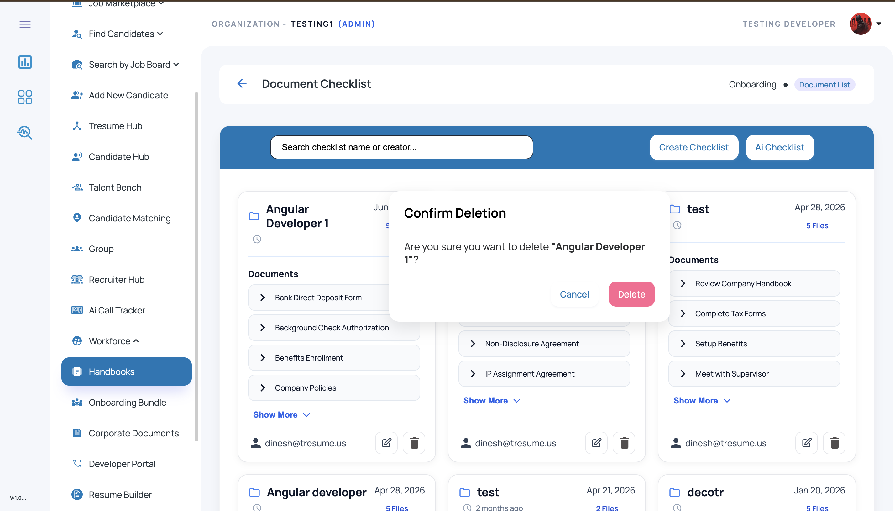

# Document Checklist Manager

A **document checklist management module** built with **Angular**, **Node.js**, and **Microsoft SQL Server** for managing onboarding and HR document checklists inside an ATS / HRMS workflow.

This module allows admins or recruiters to **create, update, delete, and manage checklist templates** containing required employee or candidate documents such as offer letters, contracts, policy acknowledgements, tax forms, compliance forms, and onboarding documents.

---

## 🚀 Overview

The **Document Checklist Manager** is designed for organizations that need to manage reusable document checklists for onboarding, compliance, HR operations, or employee handbooks.

Instead of manually tracking required documents for each role or onboarding flow, users can:

* create a checklist template
* add multiple required documents
* edit checklist name and document items
* remove unwanted checklist templates
* search and browse saved checklists
* reuse checklists for onboarding or document assignment flows

This module is useful for **ATS platforms, HRMS products, onboarding systems, and internal document management workflows**.

---

## ✨ Features

## 1) Create Checklist

Users can create a new checklist by:

* entering a checklist name
* selecting one or more document items
* creating custom document entries
* saving the checklist as a reusable template

Examples:

* Angular Developer Onboarding
* Web Developer Checklist
* HR Joining Documents
* Background Verification Checklist

---

## 2) Update Checklist

Existing checklist templates can be edited to:

* rename the checklist
* add new documents
* remove existing documents
* change checklist composition as onboarding requirements evolve

---

## 3) Delete Checklist

Checklist templates can be removed using a delete action with confirmation modal support.

This helps keep the system clean and allows old or unused templates to be archived or removed.

---

## 4) Search Checklist

The UI supports searching checklist templates by:

* checklist name
* creator
* related document labels (depending on implementation)

---

## 5) Document Selection Modal

Checklist creation and update flows use a **document selection modal** where users can:

* enter checklist name
* filter available documents
* select multiple document items
* add custom document entries
* review selected item count

---

## 6) Checklist Card View

Saved checklist templates are shown in a card-based layout with:

* checklist title
* created date
* document count
* preview of checklist items
* show more / expand support
* edit and delete actions

---

## 7) Onboarding / HR Use Cases

This module can be used to manage checklists for:

* employee onboarding
* candidate onboarding
* compliance documentation
* HR joining formalities
* legal agreements
* IT asset handover documents
* handbook acknowledgment workflows

---

## 🛠️ Tech Stack

### Frontend

* **Angular**
* **TypeScript**
* **HTML5**
* **SCSS / CSS**
* **Angular Material**

### Backend

* **Node.js**
* **Express.js**

### Database

* **Microsoft SQL Server**

---

## 📂 Project Structure

```bash
document-checklist-manager/
│
├── frontend/                                 # Angular application
│   ├── src/
│   │   ├── app/
│   │   │   ├── components/
│   │   │   │   ├── checklist-list/
│   │   │   │   ├── checklist-modal/
│   │   │   │   ├── checklist-card/
│   │   │   │   └── delete-confirm-dialog/
│   │   │   ├── services/
│   │   │   ├── models/
│   │   │   └── shared/
│   │   ├── assets/
│   │   └── environments/
│   └── angular.json
│
├── backend/                                  # Node.js / Express backend
│   ├── routes/
│   ├── controllers/
│   ├── db/
│   ├── config/
│   └── server.js
│
├── database/
│   └── schema.sql
│
├── screenshots/
│   ├── checklist-list.png
│   ├── checklist-create-modal.png
│   ├── checklist-edit-modal.png
│   └── checklist-delete-confirm.png
│
└── README.md
```

---

## 🖥️ UI Screens Included

## 1. Checklist List Screen

Displays all saved checklists in a card view with:

* checklist title
* created date
* document preview
* file count
* creator details
* edit and delete actions

---

## 2. Create Checklist Modal

Used to create a new checklist by:

* entering checklist name
* selecting multiple document items
* adding custom document entries
* saving selected documents as a checklist template

---

## 3. Edit Checklist Modal

Used to update an existing checklist by:

* changing checklist name
* modifying selected document items
* updating checklist structure

---

## 4. Delete Confirmation Dialog

Used to confirm checklist deletion before permanently removing a checklist.

---

## 📸 Screenshots

### Checklist List



### Create Checklist Modal



### Edit Checklist Modal



### Delete Confirmation



> Create a folder named **`screenshots`** in the repo root and upload your screenshots using these exact names:

* `checklist-list.png`
* `checklist-create-modal.png`
* `checklist-edit-modal.png`
* `checklist-delete-confirm.png`

---

## 🔄 Typical Workflow

1. User opens the **Document Checklist** screen
2. Clicks **Create Checklist**
3. Enters checklist name
4. Selects required documents from the document list
5. Optionally adds custom documents
6. Saves the checklist template
7. Checklist appears in the checklist list page
8. User can later edit or delete the checklist as needed

---

## 🧪 Example Checklist JSON Structure

```json
{
  "checklistId": 101,
  "checklistName": "Angular Developer Onboarding",
  "createdBy": "dinesh@tresume.us",
  "createdAt": "2026-06-25T10:30:00Z",
  "documents": [
    {
      "documentId": 1,
      "documentName": "Background Check Authorization",
      "type": "Base"
    },
    {
      "documentId": 2,
      "documentName": "Bank Direct Deposit Form",
      "type": "Base"
    },
    {
      "documentId": 3,
      "documentName": "Benefits Enrollment",
      "type": "AI"
    }
  ]
}
```

---

## 🗄️ Example SQL Table Structure

### Checklist Master Table

```sql
CREATE TABLE CreatedChecklist (
    ChecklistId INT IDENTITY(1,1) PRIMARY KEY,
    ChecklistName NVARCHAR(255) NOT NULL,
    ChecklistType NVARCHAR(MAX) NULL,
    CreateBy NVARCHAR(255) NULL,
    RecruiterID INT NULL,
    OrgID INT NULL,
    OrgDiv INT NULL,
    Active INT DEFAULT 1,
    CreatedAt DATETIME DEFAULT GETDATE(),
    UpdatedAt DATETIME NULL
);
```

### Document Master Table

```sql
CREATE TABLE OnBoardingDocList (
    DocumentId INT IDENTITY(1,1) PRIMARY KEY,
    DocsName NVARCHAR(255) NOT NULL,
    Active INT DEFAULT 1,
    CreatedAt DATETIME DEFAULT GETDATE()
);
```

> In some implementations, `ChecklistType` stores selected document IDs / JSON mappings for checklist items.

---

## ⚙️ Setup Instructions

## 1) Clone the repository

```bash
git clone https://github.com/YOUR-USERNAME/document-checklist-manager.git
cd document-checklist-manager
```

---

## 2) Frontend setup (Angular)

```bash
cd frontend
npm install
ng serve
```

Open in browser:

```bash
http://localhost:4200
```

---

## 3) Backend setup (Node.js)

```bash
cd backend
npm install
npm start
```

---

## 4) Database setup (Microsoft SQL Server)

* Create a SQL Server database
* Run the schema file from the `database/` folder
* Update SQL connection config in the backend

Example config:

```js
const config = {
  user: "your_sql_username",
  password: "your_sql_password",
  server: "localhost",
  database: "CHECKLIST_DB",
  options: {
    trustServerCertificate: true
  }
};
```

---

## 🔌 Example API Endpoints

* `GET /document` → fetch available document master list
* `GET /checklistDocuments` → fetch checklist templates
* `GET /Checklistdetails` → fetch checklist details based on access filters
* `POST /createDocuments` → create new checklist
* `PUT /update` → update existing checklist
* `DELETE /checklist/:id` → delete checklist

---

## 📈 Use Cases

This project can be used as a demo / reference implementation for:

* onboarding document checklist systems
* HR joining document management
* employee document bundle creation
* recruiter onboarding checklist templates
* compliance document collection workflows
* ATS / HRMS checklist modules

---

## 🔒 Important Note

This repository should be published as a **demo / showcase version** only.
Do **not** upload:

* real employee names or emails
* internal company document data
* production SQL credentials
* `.env` files with secrets

Use **mock / sanitized checklist data** before publishing publicly on GitHub.

---

## 🚀 Future Improvements

* drag-and-drop document ordering
* checklist duplication / clone option
* role-based checklist templates
* checklist sharing across recruiters
* import/export checklist templates
* checklist version history
* onboarding assignment directly from checklist

---

## 👨‍💻 Author

**Dinesh M**
Software Developer | Angular · Node.js · Microsoft SQL Server · ATS / HRMS · AI Automation

* GitHub: https://github.com/Dinesh-T-2005
* LinkedIn: https://www.linkedin.com/in/dinesh-m-a5698b330/
* Email: [dinesh996528@gmail.com](mailto:dinesh996528@gmail.com)

---

## 📄 License

This project is shared for learning, demonstration, and portfolio purposes.
